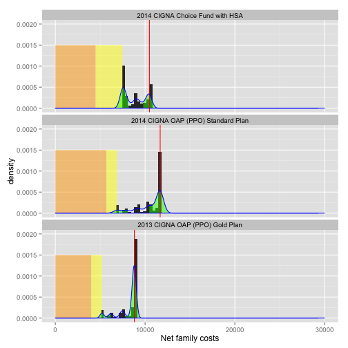

Insurance Cost Estimator
========================================================


```r
require(knitr)
require(plyr)
```

```
## Loading required package: plyr
```

```r
require(ggplot2)
```

```
## Loading required package: ggplot2
```

```r
source("func.r")
```


## Declare available policies

Policy attributes include a name, the individual deductible, the family deductible, the copay percentage (as the share paid by the insurer), the individual out-of-pocket maximum, the family out-of-pocket maximum, and the monthly premium.


```r

policies <- rbind(data.frame(policy.name = "2014 CIGNA Choice Fund with HSA", 
    ind.deductible = 1500, fam.deductible = 3000, copay.pct = 0.8, ind.oop.max = 1500, 
    fam.oop.max = 12000, premium = (186.75 * 2)), data.frame(policy.name = "2014 CIGNA OAP (PPO) Standard Plan", 
    ind.deductible = 600, fam.deductible = 1200, copay.pct = 0.8, ind.oop.max = 600, 
    fam.oop.max = 4800, premium = (236.67 * 2)), data.frame(policy.name = "2013 CIGNA OAP (PPO) Gold Plan", 
    ind.deductible = 600, fam.deductible = 1200, copay.pct = 0.8, ind.oop.max = 2400, 
    fam.oop.max = 4800, premium = (166.67 * 2)))
policies$policy.id <- row.names(policies)
```


## Declare family members

Each family member has a name, a baseline cost for doctor's visits, a risk of incurring sickness-related expenses, and a risk of catastrophic indury or illness. 

The risk factors are probabilities passed to a binomial distribution. If the result is 1, a Poisson distribution is used to estimate costs. 

In the following sample family, Parent A visits the doctor less than Parent A, and the children are more likely to get sick. Everyone has a 1% chance of catastrophic sickness or injury.


```r
insured <- rbind(data.frame(Name = "Parent A", VisitBase = 150, SickRisk = 0.1, 
    CatRisk = 0.01), data.frame(Name = "Parent B", VisitBase = 500, SickRisk = 0.2, 
    CatRisk = 0.01), data.frame(Name = "Child C", VisitBase = 250, SickRisk = 0.4, 
    CatRisk = 0.01), data.frame(Name = "Child D", VisitBase = 250, SickRisk = 0.4, 
    CatRisk = 0.01), data.frame(Name = "Child E", VisitBase = 250, SickRisk = 0.4, 
    CatRisk = 0.01), data.frame(Name = "Child F", VisitBase = 250, SickRisk = 0.4, 
    CatRisk = 0.01), data.frame(Name = "Child CG", VisitBase = 250, SickRisk = 0.4, 
    CatRisk = 0.01))
```


## Run _n_ iterations of the family's possible years with each policy


```r
n <- 500
costs <- yearcosts(insured, n)
subset(costs, cost.iteration == 1)
```

```
##          Name cost.iteration     name visit.cost sick.cost cat.cost
## 1    Parent A              1 Parent A     157.76         0        0
## 501  Parent B              1 Parent B     144.29         0        0
## 1001  Child C              1  Child C      82.23         0        0
## 1501  Child D              1  Child D     132.55       600        0
## 2001  Child E              1  Child E     133.71         0        0
## 2501  Child F              1  Child F     156.33         0        0
## 3001 Child CG              1 Child CG     131.00         0        0
```

```r
# The `scenarios` are unique combinations of each policy, family member, and
# iteration year
scenarios <- explode.scenarios(costs, policies)
head(scenarios)
```

```
##       Name cost.iteration     name visit.cost sick.cost cat.cost
## 1 Parent A              1 Parent A      157.8         0        0
## 2 Parent A              2 Parent A      509.3         0        0
## 3 Parent A              3 Parent A      337.8       500        0
## 4 Parent A              4 Parent A      235.0         0        0
## 5 Parent A              5 Parent A      231.9       500        0
## 6 Parent A              6 Parent A      279.9       500        0
##                       policy.name ind.deductible fam.deductible copay.pct
## 1 2014 CIGNA Choice Fund with HSA           1500           3000       0.8
## 2 2014 CIGNA Choice Fund with HSA           1500           3000       0.8
## 3 2014 CIGNA Choice Fund with HSA           1500           3000       0.8
## 4 2014 CIGNA Choice Fund with HSA           1500           3000       0.8
## 5 2014 CIGNA Choice Fund with HSA           1500           3000       0.8
## 6 2014 CIGNA Choice Fund with HSA           1500           3000       0.8
##   ind.oop.max fam.oop.max premium policy.id
## 1        1500       12000   373.5         1
## 2        1500       12000   373.5         1
## 3        1500       12000   373.5         1
## 4        1500       12000   373.5         1
## 5        1500       12000   373.5         1
## 6        1500       12000   373.5         1
```

```r
str(scenarios)
```

```
## 'data.frame':	10500 obs. of  14 variables:
##  $ Name          : Factor w/ 7 levels "Parent A","Parent B",..: 1 1 1 1 1 1 1 1 1 1 ...
##  $ cost.iteration: int  1 2 3 4 5 6 7 8 9 10 ...
##  $ name          : Factor w/ 7 levels "Parent A","Parent B",..: 1 1 1 1 1 1 1 1 1 1 ...
##  $ visit.cost    : num  158 509 338 235 232 ...
##  $ sick.cost     : num  0 0 500 0 500 500 500 0 0 0 ...
##  $ cat.cost      : num  0 0 0 0 0 0 0 0 0 0 ...
##  $ policy.name   : Factor w/ 3 levels "2014 CIGNA Choice Fund with HSA",..: 1 1 1 1 1 1 1 1 1 1 ...
##  $ ind.deductible: num  1500 1500 1500 1500 1500 1500 1500 1500 1500 1500 ...
##  $ fam.deductible: num  3000 3000 3000 3000 3000 3000 3000 3000 3000 3000 ...
##  $ copay.pct     : num  0.8 0.8 0.8 0.8 0.8 0.8 0.8 0.8 0.8 0.8 ...
##  $ ind.oop.max   : num  1500 1500 1500 1500 1500 1500 1500 1500 1500 1500 ...
##  $ fam.oop.max   : num  12000 12000 12000 12000 12000 12000 12000 12000 12000 12000 ...
##  $ premium       : num  374 374 374 374 374 ...
##  $ policy.id     : chr  "1" "1" "1" "1" ...
```

```r
# subset(scenarios, cost.iteration == 1)

# the calculate_family() function aggregates the scenarios to the family
# level
results <- calculate.family(scenarios)
head(results)
```

```
##                      policy.name cost.iteration fam.costs fam.deductible
## 1 2013 CIGNA OAP (PPO) Gold Plan              1      1538           1200
## 2 2013 CIGNA OAP (PPO) Gold Plan              2      4149           1200
## 3 2013 CIGNA OAP (PPO) Gold Plan              3      3034           1200
## 4 2013 CIGNA OAP (PPO) Gold Plan              4      4112           1200
## 5 2013 CIGNA OAP (PPO) Gold Plan              5      3681           1200
## 6 2013 CIGNA OAP (PPO) Gold Plan              6      3296           1200
##   copay.pct premium fam.oop.max fam.sub.ded fam.post.ded fam.copay
## 1       0.8   333.3        4800        1538        337.9     270.3
## 2       0.8   333.3        4800        4149       2949.5    2359.6
## 3       0.8   333.3        4800        3034       1833.8    1467.1
## 4       0.8   333.3        4800        4112       2911.7    2329.3
## 5       0.8   333.3        4800        3681       2480.6    1984.5
## 6       0.8   333.3        4800        3296       2096.2    1676.9
##   annual.premium fam.net fam.net.max fam.net.capped
## 1           4000    5808        8800           5808
## 2           4000   10509        8800           8800
## 3           4000    8501        8800           8501
## 4           4000   10441        8800           8800
## 5           4000    9665        8800           8800
## 6           4000    8973        8800           8800
```


Measure the probability densities of the results, by policy. Assign some tail boundaries of interest for later graphing.


```r
tail.limit.left <- 0.333
tail.limit.right <- 0.666
dxy <- ddply(results, .(policy.name), summarize, dx = density(fam.net.capped)$x, 
    dy = density(fam.net.capped)$y)
dxy <- ddply(dxy, .(policy.name), transform, qleft = quantile(dx, tail.limit.left), 
    qright = quantile(dx, tail.limit.right))
```

```
## Warning: row names were found from a short variable and have been
## discarded Warning: row names were found from a short variable and have
## been discarded Warning: row names were found from a short variable and
## have been discarded
```

```r
dxy$ytail <- ifelse(dxy$dx <= dxy$qleft | dxy$dx >= dxy$qright, dxy$dy, 0)
```


Plot the outcomes


```r
ggplot(results) + geom_density(aes(x = fam.net.capped)) + geom_area(data = dxy, 
    aes(x = dx, y = ytail), fill = "green", colour = NA, alpha = 0.5) + geom_vline(aes(xintercept = fam.net.max), 
    color = "red") + facet_wrap(~policy.name, ncol = 1)
```

 

```r

ggplot(results) + geom_histogram(aes(x = fam.net.capped), binwidth = 100) + 
    geom_vline(aes(xintercept = fam.net.max), color = "red") + facet_wrap(~policy.name, 
    ncol = 1)
```

 


Create some range spans so the x axis on each graph can how much of the net costs are composed of premiums (orange box), deductible costs paid at 100% (yellow box), and post-deductible copays (the amount between the yellow box and the total cost).


```r
ranges <- policies
# annualize the monthly premium
ranges$premium <- ranges$premium * 12
# Calculate the premium + deductible out-of-pocket baseline
ranges$dedplusprem <- ranges$fam.deductible + ranges$premium
dummyranges <- ranges
dummyranges$dedplusprem <- dummyranges$premium
dummyranges$premium <- 0
ranges <- rbind(dummyranges, ranges)
```


Plot the ranges behind the distribution graphs.


```r
ggplot(results, aes(x = fam.net.capped)) + geom_histogram(aes(y = ..density..), 
    binwidth = density(results$fam.net.capped)$bw) + geom_area(data = ranges, 
    aes(x = premium, y = 0.0015), fill = "orange", alpha = 0.5) + geom_area(data = ranges, 
    aes(x = dedplusprem, y = 0.0015), fill = "yellow", alpha = 0.5) + geom_area(data = dxy, 
    aes(x = dx, y = ytail), fill = "green", colour = NA, alpha = 0.5) + geom_vline(aes(xintercept = fam.net.max), 
    color = "red") + geom_density(color = "blue") + facet_wrap(~policy.name, 
    ncol = 1) + scale_y_continuous(limits = c(0, 0.0025)) + scale_x_continuous("Net family costs", 
    limits = c(0, 30000))
```

 


