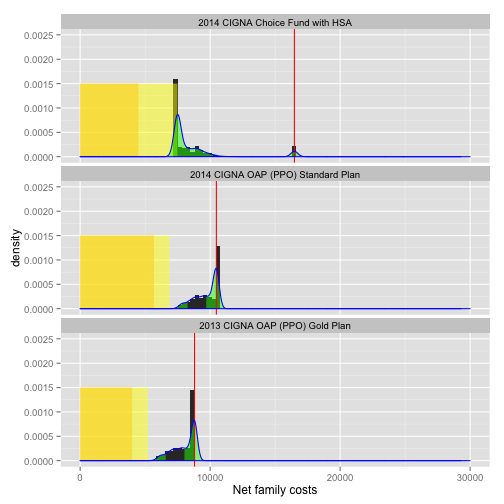

Insurance Cost Estimator
========================================================


```r
require(knitr)
require(plyr)
```

```
## Loading required package: plyr
```

```r
require(ggplot2)
```

```
## Loading required package: ggplot2
```

```r
source("func.r")
```


Declare available policies:


```r

policies <- rbind(data.frame(policy.name = "2014 CIGNA Choice Fund with HSA", 
    ind.deductible = 1500, fam.deductible = 3000, copay.pct = 0.8, ind.oop.max = 1500, 
    fam.oop.max = 12000, premium = (186.75 * 2)), data.frame(policy.name = "2014 CIGNA OAP (PPO) Standard Plan", 
    ind.deductible = 600, fam.deductible = 1200, copay.pct = 0.8, ind.oop.max = 600, 
    fam.oop.max = 4800, premium = (236.67 * 2)), data.frame(policy.name = "2013 CIGNA OAP (PPO) Gold Plan", 
    ind.deductible = 600, fam.deductible = 1200, copay.pct = 0.8, ind.oop.max = 2400, 
    fam.oop.max = 4800, premium = (166.67 * 2)))
policies$policy.id <- row.names(policies)
```


Declare family members:


```r
insured <- rbind(data.frame(Name = "Parent A", VisitBase = 250, SickRisk = 0.1, 
    CatRisk = 0.01), data.frame(Name = "Parent B", VisitBase = 500, SickRisk = 0.2, 
    CatRisk = 0.01), data.frame(Name = "Child C", VisitBase = 250, SickRisk = 0.4, 
    CatRisk = 0.01), data.frame(Name = "Child D", VisitBase = 250, SickRisk = 0.4, 
    CatRisk = 0.01), data.frame(Name = "Child E", VisitBase = 250, SickRisk = 0.4, 
    CatRisk = 0.01), data.frame(Name = "Child F", VisitBase = 250, SickRisk = 0.4, 
    CatRisk = 0.01), data.frame(Name = "Child CG", VisitBase = 250, SickRisk = 0.4, 
    CatRisk = 0.01))
```


Run a year with _n_ iterations:


```r
n <- 500
costs <- yearcosts(insured, n)
head(costs)
```

```
##       Name cost.iteration     name visit.cost sick.cost cat.cost
## 1 Parent A              1 Parent A      269.5         0        0
## 2 Parent A              2 Parent A      479.3         0        0
## 3 Parent A              3 Parent A      233.2         0        0
## 4 Parent A              4 Parent A      305.6       300        0
## 5 Parent A              5 Parent A      269.0         0        0
## 6 Parent A              6 Parent A      247.8       300    13000
```

```r
subset(costs, cost.iteration == 1)
```

```
##          Name cost.iteration     name visit.cost sick.cost cat.cost
## 1    Parent A              1 Parent A      269.5         0        0
## 501  Parent B              1 Parent B      240.3       600        0
## 1001  Child C              1  Child C      299.1         0        0
## 1501  Child D              1  Child D      244.5         0        0
## 2001  Child E              1  Child E      231.0         0        0
## 2501  Child F              1  Child F      257.3         0        0
## 3001 Child CG              1 Child CG      309.8         0        0
```

```r
scenarios <- explode.scenarios(costs, policies)
head(scenarios)
```

```
##       Name cost.iteration     name visit.cost sick.cost cat.cost
## 1 Parent A              1 Parent A      269.5         0        0
## 2 Parent A              2 Parent A      479.3         0        0
## 3 Parent A              3 Parent A      233.2         0        0
## 4 Parent A              4 Parent A      305.6       300        0
## 5 Parent A              5 Parent A      269.0         0        0
## 6 Parent A              6 Parent A      247.8       300    13000
##                       policy.name ind.deductible fam.deductible copay.pct
## 1 2014 CIGNA Choice Fund with HSA           1500           3000       0.8
## 2 2014 CIGNA Choice Fund with HSA           1500           3000       0.8
## 3 2014 CIGNA Choice Fund with HSA           1500           3000       0.8
## 4 2014 CIGNA Choice Fund with HSA           1500           3000       0.8
## 5 2014 CIGNA Choice Fund with HSA           1500           3000       0.8
## 6 2014 CIGNA Choice Fund with HSA           1500           3000       0.8
##   ind.oop.max fam.oop.max premium policy.id
## 1        1500       12000   373.5         1
## 2        1500       12000   373.5         1
## 3        1500       12000   373.5         1
## 4        1500       12000   373.5         1
## 5        1500       12000   373.5         1
## 6        1500       12000   373.5         1
```

```r
str(scenarios)
```

```
## 'data.frame':	10500 obs. of  14 variables:
##  $ Name          : Factor w/ 7 levels "Parent A","Parent B",..: 1 1 1 1 1 1 1 1 1 1 ...
##  $ cost.iteration: int  1 2 3 4 5 6 7 8 9 10 ...
##  $ name          : Factor w/ 7 levels "Parent A","Parent B",..: 1 1 1 1 1 1 1 1 1 1 ...
##  $ visit.cost    : num  269 479 233 306 269 ...
##  $ sick.cost     : num  0 0 0 300 0 300 300 0 0 0 ...
##  $ cat.cost      : num  0 0 0 0 0 13000 0 0 13000 0 ...
##  $ policy.name   : Factor w/ 3 levels "2014 CIGNA Choice Fund with HSA",..: 1 1 1 1 1 1 1 1 1 1 ...
##  $ ind.deductible: num  1500 1500 1500 1500 1500 1500 1500 1500 1500 1500 ...
##  $ fam.deductible: num  3000 3000 3000 3000 3000 3000 3000 3000 3000 3000 ...
##  $ copay.pct     : num  0.8 0.8 0.8 0.8 0.8 0.8 0.8 0.8 0.8 0.8 ...
##  $ ind.oop.max   : num  1500 1500 1500 1500 1500 1500 1500 1500 1500 1500 ...
##  $ fam.oop.max   : num  12000 12000 12000 12000 12000 12000 12000 12000 12000 12000 ...
##  $ premium       : num  374 374 374 374 374 ...
##  $ policy.id     : chr  "1" "1" "1" "1" ...
```

```r
subset(scenarios, cost.iteration == 1)
```

```
##           Name cost.iteration     name visit.cost sick.cost cat.cost
## 1     Parent A              1 Parent A      269.5         0        0
## 501   Parent B              1 Parent B      240.3       600        0
## 1001   Child C              1  Child C      299.1         0        0
## 1501   Child D              1  Child D      244.5         0        0
## 2001   Child E              1  Child E      231.0         0        0
## 2501   Child F              1  Child F      257.3         0        0
## 3001  Child CG              1 Child CG      309.8         0        0
## 3501  Parent A              1 Parent A      269.5         0        0
## 4001  Parent B              1 Parent B      240.3       600        0
## 4501   Child C              1  Child C      299.1         0        0
## 5001   Child D              1  Child D      244.5         0        0
## 5501   Child E              1  Child E      231.0         0        0
## 6001   Child F              1  Child F      257.3         0        0
## 6501  Child CG              1 Child CG      309.8         0        0
## 7001  Parent A              1 Parent A      269.5         0        0
## 7501  Parent B              1 Parent B      240.3       600        0
## 8001   Child C              1  Child C      299.1         0        0
## 8501   Child D              1  Child D      244.5         0        0
## 9001   Child E              1  Child E      231.0         0        0
## 9501   Child F              1  Child F      257.3         0        0
## 10001 Child CG              1 Child CG      309.8         0        0
##                              policy.name ind.deductible fam.deductible
## 1        2014 CIGNA Choice Fund with HSA           1500           3000
## 501      2014 CIGNA Choice Fund with HSA           1500           3000
## 1001     2014 CIGNA Choice Fund with HSA           1500           3000
## 1501     2014 CIGNA Choice Fund with HSA           1500           3000
## 2001     2014 CIGNA Choice Fund with HSA           1500           3000
## 2501     2014 CIGNA Choice Fund with HSA           1500           3000
## 3001     2014 CIGNA Choice Fund with HSA           1500           3000
## 3501  2014 CIGNA OAP (PPO) Standard Plan            600           1200
## 4001  2014 CIGNA OAP (PPO) Standard Plan            600           1200
## 4501  2014 CIGNA OAP (PPO) Standard Plan            600           1200
## 5001  2014 CIGNA OAP (PPO) Standard Plan            600           1200
## 5501  2014 CIGNA OAP (PPO) Standard Plan            600           1200
## 6001  2014 CIGNA OAP (PPO) Standard Plan            600           1200
## 6501  2014 CIGNA OAP (PPO) Standard Plan            600           1200
## 7001      2013 CIGNA OAP (PPO) Gold Plan            600           1200
## 7501      2013 CIGNA OAP (PPO) Gold Plan            600           1200
## 8001      2013 CIGNA OAP (PPO) Gold Plan            600           1200
## 8501      2013 CIGNA OAP (PPO) Gold Plan            600           1200
## 9001      2013 CIGNA OAP (PPO) Gold Plan            600           1200
## 9501      2013 CIGNA OAP (PPO) Gold Plan            600           1200
## 10001     2013 CIGNA OAP (PPO) Gold Plan            600           1200
##       copay.pct ind.oop.max fam.oop.max premium policy.id
## 1           0.8        1500       12000   373.5         1
## 501         0.8        1500       12000   373.5         1
## 1001        0.8        1500       12000   373.5         1
## 1501        0.8        1500       12000   373.5         1
## 2001        0.8        1500       12000   373.5         1
## 2501        0.8        1500       12000   373.5         1
## 3001        0.8        1500       12000   373.5         1
## 3501        0.8         600        4800   473.3         2
## 4001        0.8         600        4800   473.3         2
## 4501        0.8         600        4800   473.3         2
## 5001        0.8         600        4800   473.3         2
## 5501        0.8         600        4800   473.3         2
## 6001        0.8         600        4800   473.3         2
## 6501        0.8         600        4800   473.3         2
## 7001        0.8        2400        4800   333.3         3
## 7501        0.8        2400        4800   333.3         3
## 8001        0.8        2400        4800   333.3         3
## 8501        0.8        2400        4800   333.3         3
## 9001        0.8        2400        4800   333.3         3
## 9501        0.8        2400        4800   333.3         3
## 10001       0.8        2400        4800   333.3         3
```

```r
results <- calculate.family(scenarios)
head(results)
```

```
##                      policy.name cost.iteration fam.costs fam.deductible
## 1 2013 CIGNA OAP (PPO) Gold Plan              1      2451           1200
## 2 2013 CIGNA OAP (PPO) Gold Plan              2      3378           1200
## 3 2013 CIGNA OAP (PPO) Gold Plan              3      2235           1200
## 4 2013 CIGNA OAP (PPO) Gold Plan              4      3346           1200
## 5 2013 CIGNA OAP (PPO) Gold Plan              5      2883           1200
## 6 2013 CIGNA OAP (PPO) Gold Plan              6     24176           1200
##   copay.pct premium fam.oop.max fam.sub.ded fam.post.ded fam.copay
## 1       0.8   333.3        4800        2451         1251    1001.2
## 2       0.8   333.3        4800        3378         2178    1742.3
## 3       0.8   333.3        4800        2235         1035     828.3
## 4       0.8   333.3        4800        3346         2146    1716.5
## 5       0.8   333.3        4800        2883         1683    1346.4
## 6       0.8   333.3        4800       24176        22976   18380.5
##   annual.premium fam.net fam.net.max fam.net.capped
## 1           4000    7453        8800           7453
## 2           4000    9120        8800           8800
## 3           4000    7064        8800           7064
## 4           4000    9062        8800           8800
## 5           4000    8229        8800           8229
## 6           4000   46556        8800           8800
```


Measure the probability densities of the results, by policy

```r
dxy <- ddply(results, .(policy.name), summarize, dx = density(fam.net.capped)$x, 
    dy = density(fam.net.capped)$y)
dxy <- ddply(dxy, .(policy.name), transform, qleft = quantile(dx, 0.333), qright = quantile(dx, 
    0.666))
```

```
## Warning: row names were found from a short variable and have been
## discarded Warning: row names were found from a short variable and have
## been discarded Warning: row names were found from a short variable and
## have been discarded
```

```r
dxy$ytail <- ifelse(dxy$dx <= dxy$qleft | dxy$dx >= dxy$qright, dxy$dy, 0)
```


Plot the outcomes


```r
ggplot(results) + geom_density(aes(x = fam.net.capped)) + geom_area(data = dxy, 
    aes(x = dx, y = ytail), fill = "green", colour = NA, alpha = 0.5) + geom_vline(aes(xintercept = fam.net.max), 
    color = "red") + facet_wrap(~policy.name, ncol = 1)
```

 

```r

ggplot(results) + geom_histogram(aes(x = fam.net.capped), binwidth = 100) + 
    geom_vline(aes(xintercept = fam.net.max), color = "red") + facet_wrap(~policy.name, 
    ncol = 1)
```

 

```r

# combined density curve and probability histogram
ranges <- policies
# annualize the monthly premium
ranges$premium <- ranges$premium * 12
# Calculate the premium + deductible out-of-pocket baseline
ranges$dedplusprem <- ranges$fam.deductible + ranges$premium
dummyranges <- ranges
dummyranges$dedplusprem <- dummyranges$premium
dummyranges$premium <- 0
ranges <- rbind(dummyranges, ranges)

ggplot(results, aes(x = fam.net.capped)) + geom_histogram(aes(y = ..density..), 
    binwidth = density(results$fam.net.capped)$bw) + geom_area(data = ranges, 
    aes(x = premium, y = 0.0015), fill = "orange", alpha = 0.5) + geom_area(data = ranges, 
    aes(x = dedplusprem, y = 0.0015), fill = "yellow", alpha = 0.5) + geom_area(data = dxy, 
    aes(x = dx, y = ytail), fill = "green", colour = NA, alpha = 0.5) + geom_vline(aes(xintercept = fam.net.max), 
    color = "red") + geom_density(color = "blue") + facet_wrap(~policy.name, 
    ncol = 1) + scale_y_continuous(limits = c(0, 0.0025)) + scale_x_continuous("Net family costs", 
    limits = c(0, 30000))
```

 

```r

```


